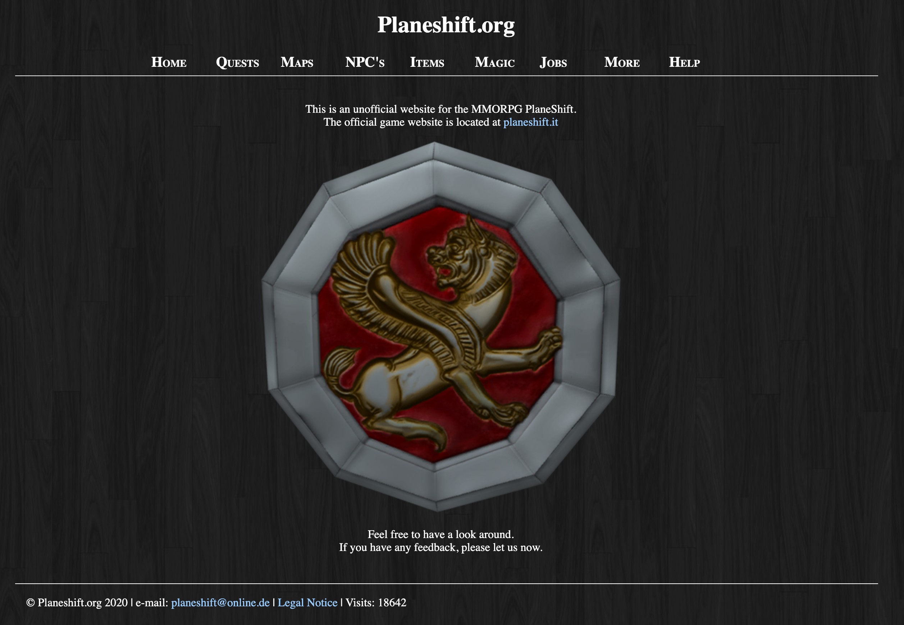

# planeshift.org

This repository contains a `database` containing informations about the game _PlaneShift_. It also contains the `source code` needed to properly display the database. The running website with all it’s information can be found at [planeshift.org](www.planeshift.org).

I put the data and code in this repository so collaboration becomes easier and a more cohesive and data-rich
website can be created. Everyone who is interested can become a collaborater or create pull requests.

## Tasks

We use Trello as organizing tool. The project can be found [here](https://trello.com/b/vvooryWE/planeshift) (access only for collaborators).

## Code

The displayed website is written in `xhtml` and `css`. The data is stored in a `mySQL` database and accessed using `PHP`. Most of the data is organized offline in `Java`.

## The Game

PlaneShift is a Role Playing Game immersed into a 3D virtual fantasy world, completely made and maintained by volunteers! Passionate RPG gamers gathered to create an open and freely available game. There are no surprises of premium content which will limit your gameplay or unbalance the game. PlaneShift is [Open Source](https://www.planeshift.it/Source%20code) for the client and server code.

## Inctructions

Instructions how the website works and how to add/delete/manipulate information can be found in the `instructions` folder

## Preview

